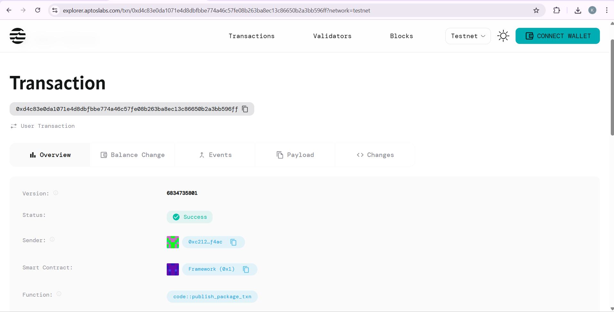

# Multi-Token Manager

## Project Description

The Multi-Token Manager is a smart contract built on the Aptos blockchain that provides a unified interface for managing multiple token types within a single contract. This solution allows users to register, track, and manage different types of tokens through a streamlined interface, making it easier to handle diverse cryptocurrency portfolios and token collections.

## Project Vision

Our vision is to create a comprehensive token management ecosystem that simplifies the complexity of handling multiple digital assets. The Multi-Token Manager aims to become the go-to solution for users, developers, and organizations who need to efficiently manage diverse token portfolios on the Aptos blockchain. We envision a future where token management is seamless, secure, and accessible to everyone in the decentralized finance space.

## Key Features

- **Unified Token Interface**: Manage multiple token types through a single contract interface
- **Token Registration System**: Easy registration of new token types with custom naming
- **Balance Tracking**: Real-time tracking of balances for all registered token types
- **Secure Transactions**: Built-in security measures to prevent unauthorized access and transfers
- **Scalable Architecture**: Designed to handle multiple token types efficiently
- **Gas Optimization**: Optimized functions to minimize transaction costs
- **User-Friendly Design**: Simple and intuitive functions for easy integration

## Future Scope

### Phase 1 (Current)
- Basic token registration and management
- Simple deposit and balance tracking functionality

### Phase 2 (Planned)
- Token transfer capabilities between accounts
- Advanced balance queries and reporting
- Token metadata management

### Phase 3 (Future)
- Cross-chain token bridging support
- Automated portfolio rebalancing
- Yield farming integration
- Liquidity pool management

### Phase 4 (Long-term Vision)
- AI-powered portfolio optimization
- DeFi protocol integrations
- Advanced analytics and reporting dashboard
- Mobile application with full functionality
- Institutional-grade features and compliance tools

## Contract Details

0xd4c83e0da1071e4d8dbfbbe774a46c57fe08b263ba8ec13c86650b2a3bb596ff
